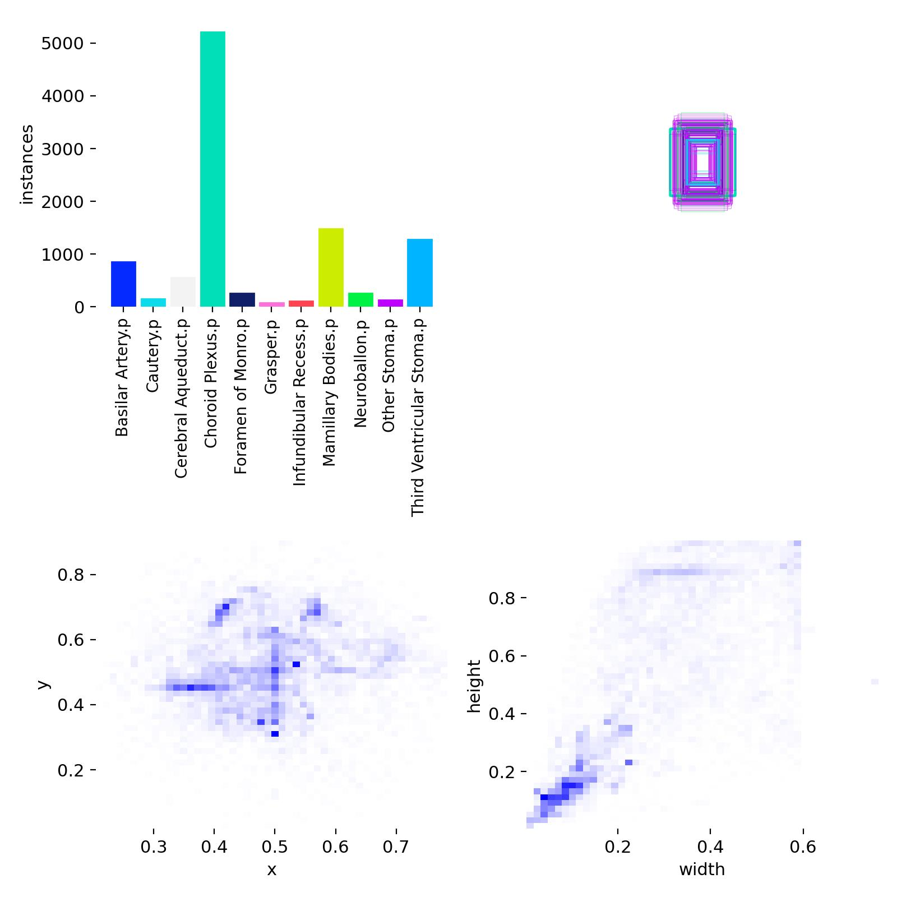

# ETV Instance Segmentation  

## Overview  

Surgical video analysis is a critical frontier in medical AI. This project, **ETV Instance Segmentation**, applies deep learning to segment anatomical structures and surgical tools in **Endoscopic Third Ventriculostomy (ETV)** procedures.  

Instance segmentation is particularly important in surgical contexts because:  

- It enables precise localization of critical structures.  
- Provides the ability to track tools and anatomy frame by frame.  
- Opens pathways for real-time feedback to surgeons.  
- Facilitates the development of intelligent surgical assistance systems.  

Unlike standard image segmentation, this project emphasizes **video-based splits**: instead of mixing frames randomly across training and testing, entire videos are separated. This ensures the evaluation closely mirrors real-world deployment, where a model must generalize to unseen surgeries.  

---

## Objectives  

The goals of this project include:  

### 1. Dataset Analysis  
- Study the class distribution and identify imbalances.  
- Ensure robust test evaluation through video-based splits.  

### 2. Model Training  
- Apply **YOLO11n-seg** for lightweight yet accurate instance segmentation.  
- Train the model on a surgical dataset for **10 epochs**.  

### 3. Performance Evaluation  
- Measure using **mAP@0.5**, precision-recall, and qualitative visualizations.  
- Identify strengths and weaknesses across different anatomical classes.  

### 4. Documentation & Reproducibility  
- Provide detailed documentation to allow others to replicate or extend the work.  
- Highlight challenges and future improvements.

---

## Source & Composition  

- **Total videos:** 44  
- **Total frames analyzed:** 12,941  
- **Training images:** 9,085  
- **Test images:** 3,856  

---

## Classes (Polygon Types)  

The dataset was annotated with **11 distinct classes**, including both anatomical structures and surgical tools:  

1. Basilar Artery  
2. Cautery  
3. Cerebral Aqueduct  
4. Choroid Plexus  
5. Foramen of Monro  
6. Grasper  
7. Infundibular Recess  
8. Mamillary Bodies  
9. Neuroballon  
10. Other Stoma  
11. Third Ventricular Stoma  

---

## Preprocessing  

- **Video-to-frame extraction:**  
  Surgical videos were decomposed into frames based on the **data_fps** field available in each video’s JSON metadata. This ensured that frames were extracted consistently at the intended frame rate, which varied across videos (e.g., **10 FPS or 15 FPS**, depending on the source video). Extracted frames were then annotated with polygon masks for each anatomical structure or surgical tool.  

- **Annotation format:**  
  Annotations were provided in **JSON format**, where each object instance was defined by polygon coordinates along with associated metadata. To extract anatomical structures and tools, the pipeline parsed the **name** or **value** fields in the JSON and mapped them to a **class ID**. For example:  
  - *Basilar Artery* → `0`  
  - *Cautery* → `1`  
  - *Cerebral Aqueduct* → `2`  
  - ...and so on.  

  This ensured that every polygon annotation was aligned with the correct class for training the segmentation model.  

- **Data split:**  
  To prevent data leakage, a strict **video-based split** was enforced. Entire videos were reserved for testing while the rest were used for training. The following videos were held out exclusively for the test set:  
  - `DL04_01_TI0YGO`  
  - `DL05_03_0MYO92`  
  - `DL01_03_0LDWR5`  

- **Class distribution:**  
  The dataset exhibited significant **imbalance across the 11 classes**. For example:  
  - **Choroid Plexus** → 6,562 instances  
  - **Infundibular Recess** → 138 instances  

  This imbalance was a known challenge during training and directly influenced performance across classes.  

